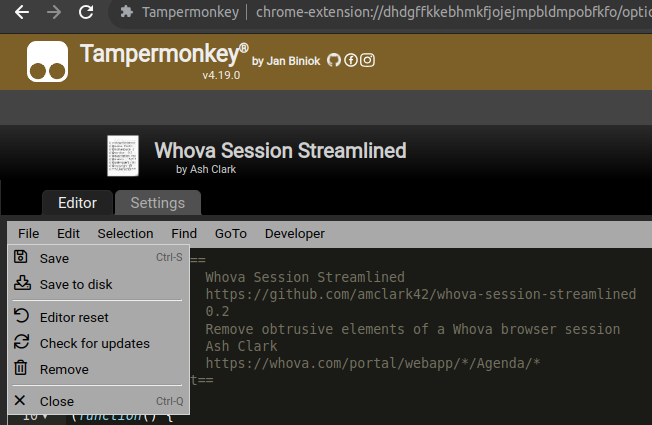

# Whova Session Streamlined

This is a user script — a Javascript file which will make some changes to a session in the Whova website. I wrote it because I was having a hard time focusing during a [session at Balisage 2023](https://balisage.net/2023/Program.html). The loud, hard-to-dismiss notifications were especially hard to ignore. This script does a few things to put more focus on the Zoom window:

1. Hides the left- and right-hand sidebars by default.
2. Adds buttons which toggle the sidebars open.
3. Adds a button which will hide notifications on the page.
4. Increases the size of the Zoom window.
5. Applies some CSS tweaks to the web page structure.

## Caveats

I've only tested this script on Chrome, on a laptop. (Whova + Zoom works best in Chromium browsers. As much as I prefer Firefox, I didn't care to bash my head against that particular restriction.)

I have not tested this script on mobile. I have not tested this on any conference besides Balisage.

I may not be willing or able to fix this script after August 4th, 2023. **[Bug reports](https://github.com/amclark42/whova-session-streamlined/issues) and pull requests are welcome at any time, however** — even if I can't fix it, you may be able to help the next person who comes along!

## How to install the script

1. Install a userscript manager. I used [Tampermonkey for Chrome](https://chrome.google.com/webstore/detail/tampermonkey/dhdgffkkebhmkfjojejmpbldmpobfkfo?hl=en).
2. Open the [Whova Session Streamlined script](https://raw.githubusercontent.com/amclark42/whova-session-streamlined/main/whova-session.user.js). 
3. Your userscript manager should open. Look the script over and if it seems good to you, "Install" it.
4. Once the script is installed, it will run automatically whenever you enter a Whova event. For example, a page with a URL that starts like this: `https://whova.com/portal/webapp/EVENT_NAME`
5. To disable the script, customize it, etc., access your userscript manager extension's dashboard.

## How to update the script (in Tampermonkey)

If you access the raw script linked above, Tampermonkey will ask if you want to reinstall, and show you the updated version. It's easy and it works well if you already have this Readme open in a tab!

Alternatively:

1. Open your userscript manager extension. Usually you can get to this via an icon near your URL bar.
2. Find the index of your installed userscripts. In Tampermonkey, this is called "Installed Userscripts".
3. Find "Whova Session Streamlined" and click on its name. This will open an editor.
4. To update the script with the latest from GitHub, open the "File" menu and choose "Check for updates". The editor will refresh with the latest changes.

You can also use the editor interface to make your own changes to the script! Be aware that your changes may be overridden by later updates; you may wish to save your modifications elsewhere.

## Shoutout

Thanks to Terrill for the [Whova Accessibility Fix script](https://github.com/terrill/whova-a11y-fix), which I used as a reference when I got stuck. Thank you for paving the way.
